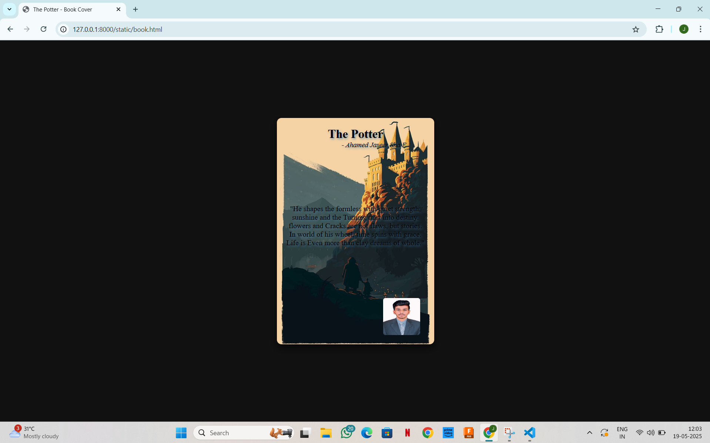

# Ex.06 Book Front Cover Page Design
## Date: 19/05/2025

## AIM:
To design a book front cover page using HTML and CSS.

## DESIGN STEPS:

### Step 1:
Create a Django Admin project.

### Step 2:
Create an app in the Django interface.

### Step 3:
Create a folder named 'static' in the app folder.

### Step 4:
Create a new HTML file in the static folder.

### Step 5:
Write the HTML code with relevant CSS properties.

### Step 6:
Choose the appropriate style and color scheme.

### Step 7:
Insert the images in their appropriate places.

### Step 8:
Publish the website in the LocalHost.

## PROGRAM:

```
<!DOCTYPE html>
<html lang="en">
<head>
  <meta charset="UTF-8">
  <title>The Potter - Book Cover</title>
  <style>
    body {
      background: #111;
      display: flex;
      justify-content: center;
      align-items: center;
      height: 100vh;
      margin: 0;
    }

    .book-cover {
      width: 300px;
      height: 450px;
      background-image: url('The Potter.jpg');
      background-size: cover;
      background-position: center;
      color: black;
      text-shadow: 2px 2px 5px rgba(70, 130, 180, 0.8);
      padding: 20px;
      box-shadow: 0 8px 16px rgba(0, 0, 0, 0.6);
      display: flex;
      flex-direction: column;
      justify-content: space-between;
      text-align: center;
      border-radius: 10px;
    }

    .book-title {
      font-size: 26px;
      font-weight: bold;
    }
    .quote p{
      font-size: 21px;
    }
    .author-name {
      font-size: 15px;
      margin-left: 80px;
      font-style: italic;
      margin-bottom: 120px;
    }

    .bottom-photo {
      width: 80px;
      height: 80px;
      border-radius: 5px;
      margin-top: 10px;
      margin-left: 70%;
    }
  </style>
</head>
<body>

  <div class="book-cover">
    <div>
      <div class="book-title">The Potter</div>
      <div class="author-name">- Ahamed Jaseer Sha E</div>
      <div class="quote">
       "He shapes the formless with quiet strength,<br>sunshine and the Turning dust into destiny.<br>flowers and Cracks are not flaws, but stories.<br>In world of his wheel, time spins with grace.<br>Life is Even more than clay dreams of whole."</div>
    </div>
    
  </div>

</body>
</html>
```

## OUTPUT:


## RESULT:
The program for designing book front cover page using HTML and CSS is completed successfully.
